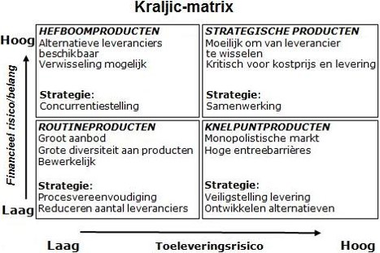
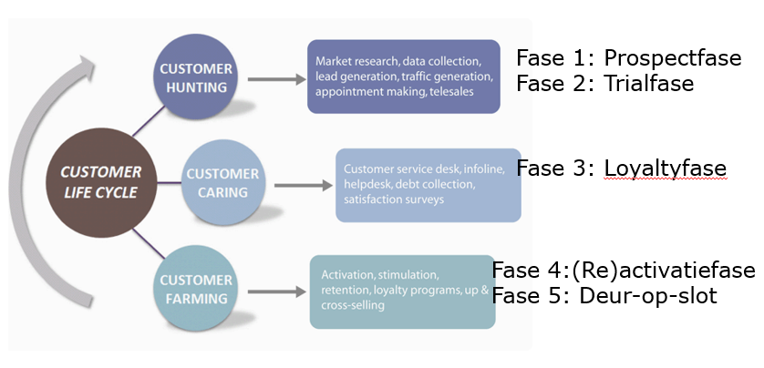

# Businessprocessen
## 0. Inleiding en afspraken
### 1. Je kan uitleggen wat BITA of Business IT Alignment inhoudt.
De muur tussen Business en IT opheffen om efficiënter businessgerichte technologische innovaties uit te werken. 
### 2. Je kan het belang van BITA in de bedrijfswereld schetsen.
BITA zorgt ervoor dat technologische innovaties meer business gericht ontwikkeld worden wat efficiënter is voor bedrijven. 
### 3. Je kan het alignment of afstemmingsmodel van Henderson en Venkatraman uitleggen en tekenen.

Het strategic alignment model van Henderson en Venkatraman wordt wel beschouwd als de ‘moeder’ van alle modellen waarin de rol van ICT binnen een organisatie op strategisch niveau beschreven wordt. Het model maakt inzichtelijk dat alle vier de invalshoeken met elkaar in balans moeten zijn: er moet sprake zijn afstemming en/of aansluiting tussen het strategisch en operationele niveau en tussen het business- en IT-domein.

### 4. Je kan aan de hand van het afstemmingsmodel van Henderson en Venkatraman vier visies op alignment benoemen en verduidelijken.
* Strategische ontwikkeling:
    - In deze traditionele visie is de bedrijfsstrategie de drijvende kracht die de operatie van de organisatie bepaalt. 
    - ICT is gewoon een hulpmiddel (‘commodity’) zoals energie en huisvesting en moet de operationele behoeften zo goed mogelijk ondersteunen. Het is de minst glamoureuze rol voor ICT, met de kleinste strategische impact.

* Technologische transformatie:
    - In de tweede visie staat ICT wat hoger op de agenda. De organisatie formuleert een duidelijke bedrijfsstrategie met heldere scenario’s en plannen. 
    - Deze strategie wordt door de ICT afdeling opgepakt en omgezet in een ICT-strategie. Op deze wijze wordt bepaald aan welke eisen ICT moet voldoen en hoe ICT zich verder strategisch moet ontwikkelen.
* Concurrentieel voordeel:
    - Een nog prominentere rol is weggelegd voor ICT in de derde visie. 
    - ICT is een katalysator voor nieuwe ideeën en technologische innovatie van de organisatie. Deze ideeën worden opgepakt door de organisatie en meegenomen in de bedrijfsstrategie van waaruit deze ontwikkelingen een plek krijgen in de dagdagelijkse operaties.
* Serviceniveau:
    - In de laatste visie heeft ICT het hoogste volwassenheidsniveau bereikt. ICT denkt zoals de business.
    - Technologische innovaties zijn businessgericht uitgewerkt en worden bijgevolg moeiteloos door de organisatie opgenomen. Via een soort ‘AppStore’ worden nieuwe functionaliteiten in de businessprocessen geïntegreerd.
    ***
## H1 Business process management
### 1. Je kan uitleggen wat een bedrijfsproces is.
* zet input(s) om in output(s) 
* draagt bij tot het bereiken van doelstellingen
* creëert toegevoegde waarde
* wordt aangestuurd door een vorige activiteit of door de tijd  (~event driven)
* wordt uitgevoerd door mensen in een bepaalde rol 
* wordt uitgevoerd op een of meerdere fysieke plaatsen
* is afdelingsoverschrijdend
* maakt gebruik van middelen: machines, applicaties, modellen, …
* moet voldoen aan regels (wet- en regelgeving) 

### 2. Je kan een bedrijfsproces herkennen.

### Je kan de volgende afkortingen voluit schrijven en bondig toelichten: BPM, BPMN en BPR.
* BPM: 
    - Business Process Management
    - Continu proces van herkennen, beschrijven, herontwerwpen, implementeren en meten van bedrijfsprocessen met het oog op verbetering
* BPMN: 
    - Business Process Modeling & Notation
    - Een verzameling objecten en symbolen om bedrijfsprocessen te modelleren.
* BPR: 
    - Business Process Re-engeneering
    - Fundamenteel "re-thinking and radical re-design" van businessprocessen om duurzame maatregelen in prestatie te berijken. Zoals kost, kwaliteit, service en snelheid.

### 3. Je kent het doel van BPMN in het kader van Business IT Alignment.
communicatie; Kloof dichten tussen business en IT.
### 4. Je kan uitleggen wat primaire, secundaire en managementprocessen zijn.
* Primaire of bewerkende processen:
    - Inkomende logistiek, productie, distributie, verkoop, dienst na verkoop -> transformatie
* Secundaire of ondersteunende processen: 
    - Infrastructuur, HR, Inkopen, R &D
### 5. Je kent het onderscheid tussen een functioneel en een operationeel proces.
Functionele processen zijn bewerkende/primaire processen (Inkomende logistiek, productie, distributie, verkoop, dienst na verkoop) terwijl operationele processen ondersteunende/secundaire processen (Infrastructuur, HR, Inkopen, R&D) zijn. 
### 6. Je kan uitleggen waarom functionele processen geen bedrijfsprocessen zijn.
Functionele processen zijn afdelingsgericht terwijl bedrijfsprocessen proces georiënteerd zijn.
### 7. Je kan verduidelijken wat een functionele organisatiestructuur inhoudt.
* Afdelingen op basis van bedrijfsfunctie en competenties
* Sturing top-down via hiërarchie
* Prestatie indicatoren per afdeling
* Silo denken, eiland denken
* Suboptimalisatie per afdeling
* Afdelingen die elkaar tegenwerken
* Weinig betrokkenheid met eindproduct
### 8. Je kan verduidelijken wat een procesgeoriënteerde organisatiestructuur inhoudt.
* (matrix-organisatie)
* Focus op end-to-end verantwoordelijkheid
* Werknemers kijken verder dan de eigen werkplek
* Keten denken
* Meer focus op klant
* Meer aandacht voor core business
* Gericht op corrigeren en verbeteren
* Werking sneller aanpasbaar
### 9. Je kan 5 externe en 5 interne bedrijfsregels opsommen die het modelleren van bedrijfsprocessen beïnvloeden.

### 10. Je kan het concept regulatory compliance verduidelijken.
* Bedrijfvan moeten kunnen garanderen dat hun bedrijfsprocessen en zeker hun boekhoudkundige registraties conform zijn aan wetten en kwaliteitsnormen.
### Je kan 1 praktijkvoorbeeld van BPR uitleggen zonder extra opzoekwerk.
* Wal-Mart bestelde zelf voorraad bij fabrikanten als Proctor and Gamble.  Resultaat was ofwel te kleine ofwel te grote voorraden.
* Na een BPR-proces verzorgt Proctor and Gamble zelf de voorraden bij WalMart omdat zij beter inzicht hebben in de tendensen op de markt.
* Resultaat: beter voorraadbeheer;  effectiever aanvullen van de voorraden

### 11. Je kan de meest gebruikte symbolen uit het BMPN 2.0-schema bondig beschrijven.
#### Swimlanes
- Bestaan uit:
    * Pools:
        - Bakent grenzen van proces af voor een entiteit
        - Binnen 1 pool: slechts 1 proces
    * Lanes:
        - In een pool kunnen activiteiten gegroepeerd worden in lanes.
        - Activiteiten in zelfde lane worden uitgevoerd door zelfde verantwoordelijke
        - Kunnen onderverdeeld worden in sublanes
- Bepalen swimlanes: stap 1 bij modelleren

#### Pools en message flows
* Communicatie of uitwisseling data tussen pools -> Message flow 

* Sequence Flow kan nooit tussen 2 pools!
* Voorbeeld:

#### Basis Gateway symbolen

##### Exlusive gateway
* Exclusive Input Merging:
Als meerdere stromen samen komen start de uitgaande flow wanneer er 1 input is binnengekomen

* Exclusive output splitting:
Bij splitsen van stromen wordt flow naar exact 1 uitgaande stroom gestuurd (conditie true)

* Voorbeeld:

##### Parallel Gateway
* Paralell Input Merging:
Als meerdere stromen samen komen -> uitgaande stroom wacht tot alle inkomende stromen binnen zijn

* Parallel output splitting:
Bij splitsen van inkomende stroom worden alle uitgaande stromen tegelijkertijd geactiveerd

* Voorbeeld:

### 12. Je kan op basis van een gegeven BPMN 2.0-schema een bedrijfsproces in woorden omschrijven.
(praktijk)

### 13. Je kan een in woorden omschreven bedrijfsproces modelleren in BPMN 2.0.  Je kan dit op papier en met behulp van Bizagi Process Modeler.
(praktijk)

### 14.  Je kan fouten herkennen in een BPMN 2.0 schema.
Zie dia's bij elk symbool

### 15.  Je kan op basis van een BPMN 2.0-schema voorstellen formuleren om het proces grondig te herwerken tijdens een BPR-run.
(praktijk)

### 16. Je kan op basis van een BPMN 2.0-schema de pijnpunten in het bedrijfsproces herkennen en beschrijven.
(praktijk)
### 17. Je kan een voorbeeld geven waarbij de technologie de stimulator was tot een grondige vernieuwing van het proces.

### 18. Je kan een voorbeeld geven waarbij het wijzigen van het proces de aanzet is tot het ontwikkelen van nieuwe technologieën.

***
## H2 ERP
### 1.	Je kan definiëren wat ERP is en de afkorting ERP voluit schrijven.
**Enterprise Resource Planning**
Eens softwarepakket om bedrijfsprocessen te automatiseren en te integreren zodat gemeenschappelijke gegevens bedrijfsbreed en afdelingsoverschrijdend kunnen gedeeld worden en informatie realtime kan samengesteld en beschikbaar gemaakt worden.
### 2.	Je kan uitleggen wat de term ‘Best Practices’ inhoudt.
Een techniek, werkmethode of activiteit die zich als effectiever heeft bewezen dan enige andere techniek, methode etc.
### 3.	Je kan 3 marktleiders in de ERP-markt opsommen.
* Oracle
* Microsoft
* SAP
### 4.	Je kan de rol van vendors en partners uitleggen in het ERP proces.
### 5.	Je kan de ERP-markt in België omschrijven. Je kent de 3 belangrijkste vendors en sectoren die inzetten op ERP. 
Vlaanderen kent het hoogste erp-gebruik in vergelijking met Brussel en Wallonië. 68 procent van de Vlaamse bedrijfsvestigingen maakt gebruik van erp-software, de publieke sector meegerekend. In Brussel is dat maar 51 procent

Belangrijkste sectoren:
* Groothandel
* Retail
* Industrie

Belangrijkste vendors:
* SAP
* Microsoft
* Oracle
### 6.	Je kan de evolutie in het segment volledige custom build ERP-applicaties toelichten.

### 7.	Je kan de evolutie van ERP naar ERP II uitleggen.

### 8.	Je kan de afkortingen CRM, SCM en BI voluit schrijven.
| Afkorting | Voluit |
| --------- | ------ |
| CRM       | Customer Relationship Management |
| SCM       | Supply CHain Management |
| BI        | Business Intelligence |

### 9.	Je kan de link tussen CRM, SCM, BI en ERP uitleggen.
Een ERP-systeem combineert CRM, SCM en BI

### 10.	Je kan 5 voordelen en 2 nadelen opsommen van ERP.
Voordelen:
* Maximaliseert doorstroming informatie
* Minimaliseert de responsetijd
* Verbetert operationele uitvoering
* Vermindert operationele kosten
* Verkleint voorraad

Nadelen:
* Alle gegevens moeten in de input aanwezig zijn (offertes, inkooporders etc). Als dit niet het geval is, geven de overzichten een verkeerd beeld.
* Implementatie heeft een grote impact op de organisatie.
### 11.	Je kan de afkorting TCO voluit schrijven.
Total Cost of Ownership
### 12.	Je kan het concept TCO toelichten met betrekking tot ERP.

### 13.	Je kent de belangrijkste kosten bij een ERP implementatie.
* Software
* Software licenties
* Hardware
* Consultants
* Training
* Implementatiekosten
### 14.	Je kent het begrip Payback Period in het kader van een kosten/baten analyse.
De tijd waarin een investering dmv ontvangen cash flows is terugverdiend.
### 15.	Je kan 1 succesverhaal en 1 verhaal waarbij er problemen ontstonden bij de implementatie van ERP bondig beschrijven.

### 16.	Je kan zonder bijkomend opzoekwerk de implementatie van ERP bij Gudrun beschrijven.

### 17.	Je kan minstens 3 verschilpunten opsommen tussen re-engineering en customizing.
| Re-engineering | Customizing |
| -------------- | ----------- |
| Tijd en kostefficiënt | Duur en tijdrovend |
| Bedrijfsprocessen worden geherstrucureerd | ERP-pakket wordt aangepast aan unieke bedrijfsprocessen |
| Legt beperkingen op aan het ontwerp; gebaseerd op bedrijfsmodellen en best practices | Meer flexibiliteit ten aanzien van unieke eisen; niet beperkt door de best practices zoals die door de leverancier geïnterpreteerd worden; geen beperkingen aan het ontwerp|
### 18.	Je kan 5 kritische succesfactoren van Gulla tijdens de ERP-implementatie opsommen.
1. Gestructureerde aanpak
2. Meer aandacht voor operationele processen met toegevoegde waarde voor klant
### 19.	Je kan het belang van Change Management situeren bij een implementatietraject.
De veranderingen in workflow en procedures kan de organisatie verstoren (veel weerstand). -> daarom goed change management nodig
### 20.	Je kan op basis van een case de theorie toepassen.

### 21.	Je kan een bestaand bedrijf in SAP B1 raadplegen en gegevens opzoeken. Je kan de verschillende modi van het pakket gebruiken zoals zoeken, lezen, toevoegen en wijzigen. Je kan gegevens sorteren en filteren.
knopjes vanboven

### 22.	Je kan het verschil uitleggen tussen stamgegevens (Master Data) en transactiegegevens en van beide 2 voorbeelden opsommen.
Stamgegevens zijn vaste gegevens  die gedurende ruime tijd status quo blijven. (bv zakenpartners, artikels). 
Transactiegegevens zijn gegevens die gecreërd worden naar aanleiding van een bedrijfsproces. (bv offertes, aankooporders)
### 23.	Je kan Master Data Zakenpartners aanmaken met SAP B1.
praktijk
### 24.	Je kan de werking van de betalingsconditie 30 dagen einde maand illustreren aan de hand van een cijfervoorbeeld.

### 25.	Je kan uitleggen wat er bedoeld wordt met deellevering per order toestaan.
Selecteer deze optie om aan te geven dat leverbonnen kunnen worden gecreëerd op basis van een deel van de records in een klantorder en op basis van gedeeltelijke hoeveelheden.
### 26.	Je kan Master Data Artikels aanmaken met SAP B1.
praktijk
### 27.	Je kan uitleggen welke 3 artikelclassificaties of artikelsoorten er voorzien zijn binnen B1.
* Artikel
* Werk
* Reis
### 28.	Je kan uitleggen waarom er geen 1 op 1 relatie bestaat tussen een artikel en een eenheidsprijs.
Er zijn meerdere prijslijsten in omloop. Op elk van deze lijsten wordt het artikel geprijsd.
### 29.	Je kan bij de inkoopgegevens aan de hand van een voorbeeld de volgende begrippen verklaren: inkoophoeveelheidseenheid, artikel per inkoopeenheid, verpakkingseenheid en hoeveelheid per verpakkingseenheid. 
|Begrip|Uitleg|
|------|------|
|inkoophoeveelheidseenheid| stuk, doos, etc |
|artikel per inkoopeenheid| hoeveel stuks erin in de inkoophoeveelheidseenheid zitten |
|verpakkingseenheid| hoeveel verkoop |
|hoeveelheid per verpakkingseenheid| |

### 30.	Je kan net hetzelfde voor de verkoopgegevens.

***
## H3 Inkopen
### 1.	Je kan het inkoopproces definiëren.
* Alles waar een externe factuur tegenover staat
* niet alleen verantwoordelijkheid van inkoopafdeling
* organisatiebreed
### 2.	Je kent het verschil tussen de begrippen ordering, buying, purchasing en procurement.
| Begrip | Definitie |
| -------|-----------|
|ordering| Orders plaatsen bij een supplier en zijn verkoop condities accepteren |
|buying  | Verschillende aanbiedingen van suppliers vergelijken en de aantrekkelijkste kiezen|
| purchasing| Zorgen dat producteigenschappen niet overgekwalificeerd zijn?|
| procurement| Niet enkel kijken naar aankoopprijs maart ook naar TCO|
### 3.	Je kent het verschil tussen Supply Chain Management en Value Chain Management. 
Supply Chain Management: Het managen van de suppliers van de supplier van het bedrijf voor meer efficiëntie. 
Value Chain Management: Expertise van de suppliers inzetten om meer customer gericht te zijn.
### 4.	Je kan het concept Total Cost of Ownership verduidelijken.
Alle kosten die gemaakt moeten worden om een product of dienst te verwerven
### 5.	Je kan uitleggen of het inkoopproces een operationeel of functioneel proces is. 
Functioneel
### 6.	Je kent de 6 fasen in het inkoopproces (specificeren, selecteren, contracteren, bestellen, bewaken en nazorg) en je kan elke fase verduidelijken.
|Fase| uitleg|
|----|-------|
|Specificeren| Omschrijven van de eigenschappen waaraan het product moet voldoen|
|Selecteren| Onderzoeken welke leveranciers en dienstverleners op basis van eisen en wensen vastgelegd in selectie-en gunningscriteria, het meest in aanmerking komt |
|Contracteren| Onderhandelen over de vastgelegde specificaties|
|Bestellen| Interne aanvraag tot bestelling (ATB) omzetten in externe order |
|Bewaken| Controleren of gemaakte afspraken in het contract nagekomen worden door de betrokken partijen. (kwaliteit, levertijden, verpakking,...) |
|Nazorg| Meten van prestaties van leveranciers (kwaliteit, leverbetrouwbaarheid, innoverend vermogen leverancier)|
### 7.	Je kan naast prijsafspraken 3 onderwerpen aanhalen die in een inkoopcontract worden opgenomen.
* Leveringscondities
* Garantie
* Geheimhouding
### 8.	Je kan de afkorting RASCI verduidelijken en aangeven waarom RASCI wordt toegepast op het inkoopproces.
**R**esponsible **A**ccountable **S**upport **C**onsulted **I**nformed
om fraude bij het inkoopproces te voorkomen
### 9.	Je kan de Kraljic maxtrix met behulp van een schema verduidelijken en je vergeet hierbij niet de waarden op de assen en de namen van de 4 producten in de kwadranten.

### 10.	Je kan voor elk kwadrant van de Kraljic matrix een concreet voorbeeld geven.

### 11.	Je kan op basis van een BPMN 2.0-schema het inkoopproces beschrijven.
#### Hoofdproces

#### Subprocessen
**Offertes**

**Inkooporder**

**Uitgaande betaling**

### 12.	Je kan de link tussen het inkoopproces, het verkoopproces en de productie verduidelijken.
Het inkoopproces moet inzicht hebben in de productie om de juiste voorraden grondstoffen aan te kopen en te zorgen dat deze op het juiste moment geleverd worden. De productie moet gekoppeld zijn aan het verkoopproces om juiste voorraadniveaus eindproduct te kunnen handhaven. Het verkoopproces moet inzicht hebben in de productie om realistische levertermijn af te spreken met klanten. 
### 13.	Je kan het verloop van het inkoopproces in SAP B1 vanaf de bestelling tot de betaling bondig bespreken.  Inclusief de verwerking van terugzendingen. 
1. Leveranciersofferte
2. Bestelling
3. Goederenontvangst: leverbon
4. (Retouren: leverbon)
5. Inkomende factuur
6. (Inkomende creditnota) 
7. Uitgaande betaling
### 14.	Je kan met behulp van SAP B1 het inkoopproces verwerken zoals je dit reeds deed voor Ecobos.
praktijk
### 15.	Je weet dat het minimale inkoopproces in SAP B1 uitsluitend bestaat uit registratie van de ontvangen factuur (en de uitgaande betaling).
:thumbsup:
### 16.	Je weet welke documenten uit de module inkoop in SAP B1 invloed hebben op het voorraadniveau van de producten.
* Bestelling
* Goederenontvangst bestelling
* Retouren 
### 17.	Je weet welke instellingen in de SAP B1 masterdata artikels en zakenpartners effect hebben op het inkoopproces.

### 18.	Je weet hoe prijzen aan producten en leveranciers gekoppeld worden in SAP B1.
Via inkoopprijslijsten
### 19.	Je kan cijfergegevens op SAP B1 formulieren zoals factuurbedragen, orderbedragen, rekeningsaldo, … toelichten.
zie opdracht
### 20.	Je kan datums op SAP B1 formulieren zoals leverdatum, boekingsdatum, vervaldatum, … toelichten.
zie opdracht

## H4 verkopen
### 1.	Je kan de 5 fasen van de customer life cycle opsommen en kort toelichten. 
### 2. Je kan bij elke fase 2 marketing communicatietechnieken opnoemen.
|#|Fase|Toelichting| Marketingtechnieken|
|-|----|-----------|--------------------|
|1|Acquisitie/prospectfase :blush:|Klant wordt geworven en doet zijn eerste aankopen| <ul><li>Cross-selling</li><li>Up-selling</li></ul>|
|2|Switch/trialface :man: :grey_question: :girl: :woman:|klant zoekt bevestiging, concurrerende producten worden uitgeprobeerd| <ul><li></li><li></li></ul>|
|3|Loyaltyfase :couple:|Klant wordt +- trouw en men tracht het rendement van de klant te verhogen|<ul><li></li><li></li></ul>|
|4|Re-activatiefase :running:|extra aandacht voor de klant die dreigt te "ontsnappen"|<ul><li></li><li></li></ul>|
|5|Deur-op-slotfase :couple_with_heart:|Klant zo lang mogelijk en winstgevend behouden|<ul><li></li><li></li></ul>|
 
### 3.	Je kan de 5 fasen koppelen aan de 3 luiken customer hunting, caring en farming.

### 4.	Je weet wat de begrippen cross- en upselling inhouden.
**Cross-selling:** :heavy_multiplication_x:
Het, tijdens de aankoop van een product of dienst, aanbieden van aanvullende of ondersteunende producten of diensten.
Maak de keuze voor een extra aankoop laagdrempelig. Laat de bezoeker zien dat u meedenkt. En bovenal.. maak het besteltraject door dit additionele aanbod niet onnodig complex.
Deze techniek dient enerzijds het gemak van de (online) bezoeker en onderstreept uw servicegerichtheid, anderzijds is dit een uitstekende manier om uw verkoop uit te breiden.

*Een voorbeeld. Bij de online aankoop van uw printer wordt een bijbehorende cartridge en netwerkkabel getoond. Een kabel heeft u nog liggen, maar zonder cartridge kunt u niet printen. Die nemen we ook mee!*

**Up-selling:** :arrow_up:
Sluis de klant door naar een hoogwaardiger of extra product of dienst.
Speel in op de interesses van de bezoeker door het aanbieden van vergelijkbare producten of diensten in een (vaak) duurder segment. Vermeld de extra’s en voordelen en informeer de bezoeker waarom deze specifieke, en duurdere, variant beter past bij zijn wensen en eisen.

*Een voorbeeld. U bent nog steeds op zoek naar een printer maar u ziet door de bomen het bos niet meer. Duidelijke specificaties, praktijktoepassingen, productvergelijkingen en ervaringen leiden u in uw keuze. Ondanks een hogere prijs kiest u daarom uiteindelijk toch voor die ene printer met kopieer-, scan-, én printmogelijkheid.* 

### 5.	Je weet waar de afkorting CRM voor staat.
**C**ustomer **R**elationship **M**anagement
### 6.	Je kan de relatie tussen CRM en ERP bondig uitleggen.

### 7.	Je kan 3 belangrijke spelers op de CRM markt opgeven.
1. SAP
2. Microsoft
3. Salesforce.com
### 8.	Je kent 3 functionaliteiten van een CRM systeem.
* Bestanden en content delen
* Instant messaging
* E-mailintegratie
### 9.	Je kan de link tussen het inkoopproces, het verkoopproces en de productie verduidelijken.
Het inkoopproces moet inzicht hebben in de productie om de juiste voorraden grondstoffen aan te kopen en te zorgen dat deze op het juiste moment geleverd worden. De productie moet gekoppeld zijn aan het verkoopproces om juiste voorraadniveaus eindproduct te kunnen handhaven. Het verkoopproces moet inzicht hebben in de productie om realistische levertermijn af te spreken met klanten. 
### 10.	Je kan op basis van een gegeven BPMN 2.0-schema het verkoopproces beschrijven.
zie BPMN
### 11.	Je kan een standaard verkoopproces in BPMN uittekenen.
**Order-to-cash**

**Shipment-to-cash**

### 12.	Je kan de geld, goederen en documentenstroom bij het verkoopproces met behulp van een schema uitleggen.

### 13.	Je kan met behulp van SAP B1 het verkoopproces verwerken.
zie opdracht ecobos
### 14.	Je kan het verloop van het verkoopproces vanaf de offerte tot de betaling bondig bespreken.  Je kan dit ook rekening houdend met retouren.
zie opdracht ecobos
### 15.	Je kan het verschil tussen het push forward en pul forward principe bondig uitleggen.
**Push-forward:** :push:
 Stategie die het product direct naar de klant brengt op welke manier dan ook zodat deze gewaar is van je merk bij aankoop

**Pull-forward:**
Strategie die klanten motiveert om je merk op te zoeken in een actief proces. 

### 16.	Je weet welke documenten uit de module verkopen in SAP B1 invloed hebben op het voorraadniveau van de producten.
* Klantorder
* Levering
* Retouren
### 17.	Je weet dat het minimale verkoopproces in SAP B1 uitsluitend bestaat uit registratie van de uitgaande factuur (en de binnenkomende betaling).
:thumbsup:
### 18.	Je weet hoe prijzen aan producten en klanten gekoppeld worden in SAP B1.
Via verkoopprijslijsten
### 19.	Je kan cijfergegevens op SAP B1 formulieren zoals factuurbedragen, orderbedragen, rekeningsaldo, … toelichten.
zie opdracht
### 20.	Je kan datums op SAP B1 formulieren zoals leverdatum, boekingsdatum, vervaldatum, … toelichten.
zie opdracht
### 21.	Je kan verkoopdocumenten opstellen waarbij er gewerkt wordt met alternatieve verkoophoeveelheidseenheden (pallet, doos, krat, …)
Stuklijsten
***

## H5 Productie

### 1.	Je kan de link tussen het inkoopproces, het verkoopproces en productie verduidelijken.
Problemen: :sweat:
* Toelevering grondstoffen niet op tijd
* Inadequate informatie van andere divisies bv: veranderingen in de specificaties van een order dringen niet op tijd door tot productie. 
* Spoedorders verstoren reguliere productie
* Te lange doorlooptijden omdat routing doorheen machines niet optimaal is
* Te lange insteltijden machines

Nood aan integratie met andere divisies:
* Productie moet gekoppeld zijn aan sales om juiste voorraadniveaus eindproduct te kunnen handhaven.
* Sales moet inzicht hebben in de productieplanning om een realistische levertermijn af te spreken met klanten.
* Inkopen moet inzicht hebben in de productieplanning om de juiste voorraden grondstoffen aan te kopen en te zorgen dat deze op het juiste moment (Just In Time) geleverd worden. 

### 2.	Je kan MES uitleggen en de link met ERP beschrijven.
**M**anufacturing **E**xecution **S**ystem
Is de automatiseringslaag tussen de productieaansturing op de fabrieksvloer en de ERP-systemen in de kantooromgeving.
### 3.	Je kan de afkortingen SCADA, DCS en PLC voluit schrijven en kort toelichten.
|Afkorting|Voluit|Betekenis|
|---------|------|---------|
|SCADA| **S**upervisory **C**ontrol **A**nd **D**ata **A**cquisation| verzamelen, doorsturen, verwerken en visualiseren van meet en regelsignalen van machines.|
|DCS| **D**istributed **C**ontrol **S**ystem | Onderdeel van een productiesysteem; Worden gebruikt in industriele toepassingen om een proces te volgen, sturen, en te controleren.|
|PLC| **P**rogrammable **L**ogic **C**ontroller| Elektronisch apparaat met een microprocessor die op basis van de informatie op zijn diverse ingangen, zijn uitgangen aanstuurt|
### 4.	Je kan 3 manieren van Lot Sizing (=bestelhoeveelheid bepalen) opsommen en bondig bespreken.
* Re-order point:
Wanneer voorraad onder bepaald niveau zakt, wordt vaste hoeveelheid bijbesteld.
* Order up to level:
Op vaste tijdstippen wordt voorraad aangevuld tot bepaald niveau.
* 2 bin systeem:
2 'denkbeeldige' bakkeen voorraad worden aangehouden, waarbij eerst de ene bin wordt gebruikt tot zij leeg is en vervolgens de andere. Wanneer een bin leeg is, wordt er 1 bin bijbesteld. Tot de bestelling arriveert, wordt andere bin geacht te volstaan.
### 5.	Je kan de volgende afkortingen voluit schrijven en/of bondig bespreken: MES, MRP, MPS, BOM, JIT.
|Afkorting|Voluit|Betekenis|
|---------|------|---------|
|MES|**M**anufacturing **E**xecution **S**ystem |automatiseringlaag tussen de  productieaansturing op de fabrieksvloer en de ERP-systemen in de kantooromgeving.|
|MRP| **M**aterial **R**equirements **P**lanning |bepaalt op basis van MPS en BOM-data welke materialen, in welke hoeveelheid, waar, wanneer nodig zijn |
|MPS| **M**aster **P**roduction **S**chedule |bepaalt hoeveelheden en data eindproducten |
|BOM :bomb:| **B**ill **O**f **M**aterial | een lijst van alle componenten en bewerkingen die nodig zijn om uiteindelijk een eindproduct te produceren|
|JIT| **J**ust-**I**n-**T**ime |exact nakomen van afspraken omtrent tijdstip levering |
### 6.	Je kan de 3 types stuklijsten die voorkomen in SAP B1 bespreken en je weet wanneer welk type van toepassing is.
|Stuklijst| Uitleg|Toepassing|
|---------|-------|----------|
|Productiestuklijst|omschrijving van een gereed product dat bestaat uit verschillende voorraadcomponenten.   Tijdens het productieproces worden deze samengevoegd tot een gereed product. | Fysieke artikelen en/of viruele objecten (bv uur werk) |
|Verkoopstuklijst| Het afgewerkt product wordt niet beheerd als een magazijnartikel, maar als een verkoopartikel.  De componenten kunnen zowel verkoopartikelen als magazijnartikelen zijn.| tuinset als voorbeeld van een gereed product nemen. De samenstelling van deze set kan worden gedefinieerd in een verkoopstuklijst. Het afgewerkt product wordt in dit geval niet als set in het magazijn opgeslagen, maar de verschillende componenten van de set (zoals tuinstoelen, tafels en parasols) zijn wel allemaal op voorraad. |
| Montagestuklijst| bestaat uit voorraadartikelen en/of verkoopartikelen die worden gemonteerd in de verkoopfase.  Meestal zijn de werkuren voor de montage onderdeel van de stuklijst. |Net zoals bij de verkoopstuklijst wordt het gemonteerde gereed product niet beheerd als een voorraadartikel maar uitsluitend als een verkoopartikel.  Het gemonteerde stuk ligt dus niet op voorraad in het magazijn |

### 7.	Je kan 3 soorten productieorders opsommen en bondig bespreken.
|Type|Uitleg|
|:----|:------|
|Standaard| Producten samenbrengen naar een groot product |
|Demontage| Product weer teruggebracht tot de afzonderlijke onderdelen die vervolgens naar het magazijn gebracht worden en verkocht kunne worden|
|Speciaal| Bij een speciale productieorder definieert u de componenten en de hoeveelheden die nodig zijn om het product te maken op het moment dat u de productieorder creëert. Je vertrekt dus niet van een BOM. |
### 8.	Je weet wanneer je welk type productieorder gebruikt.
:thumbsup:
### 9.	Je kan een BOM met leadtimes opstellen zoals je dit deed in deelopdracht 5 Ecobos.
opdracht ecobos
### 10.	Je kan een MRP explosie manueel berekenen zoals je dit deed in deelopdracht 5 Ecobos.
Opdracht ecobos
### 11.	Je weet welke 2 type documenten een MRP run genereert in SAP B1.
Aanbevelingen voor de productie- en inkooporders die vereist zijn om het eindproduct op tijd en in de gewenste hoeveelheid te produceren.  
Vervolgens gebruik je deze aanbevelingen om in het order-aanbevelingsverslag, productieorders en bestellingen te creëren. 
### 12.	Je kan met behulp van SAP B1 het productieproces verwerken:
a.	Je kan de 3 verschillende soorten stuklijsten verwerken binnen SAP B1. 
Je kan het bijhorende artikel aanmaken en bepalen welke vinkjes er geplaatst moeten worden: magazijnartikel, aankoopartikel en/of verkoopartikel. 
Je kan uitleggen hoe de verkoopprijs wordt bepaald en welke producten er verschijnen in het verkooporder.
Je kan de verschillen tussen de 3 soorten stuklijsten bondig uitleggen.
b.	Je kan de planningsgegevens van je artikels juist instellen zodat zowel stuklijsten als MRP runs gecreëerd kunnen worden.
c.	Je kan handmatig een productieorder aanmaken.
d.	Je kan een MRP run simuleren binnen SAP B1.
e.	Je kan de aankooporders en productieorders genereren.

